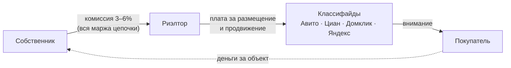
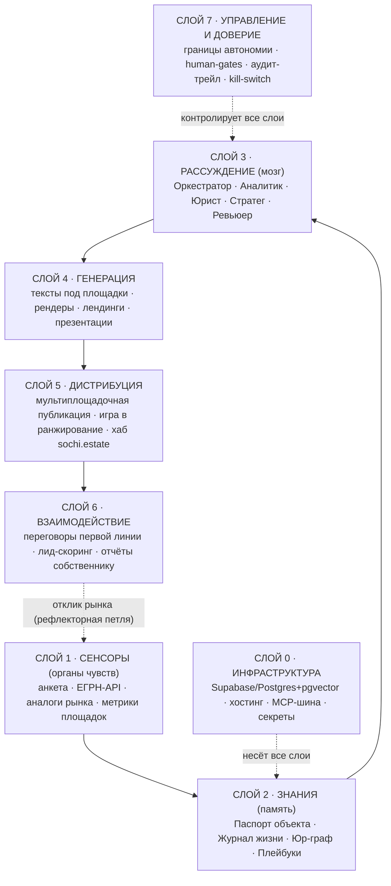
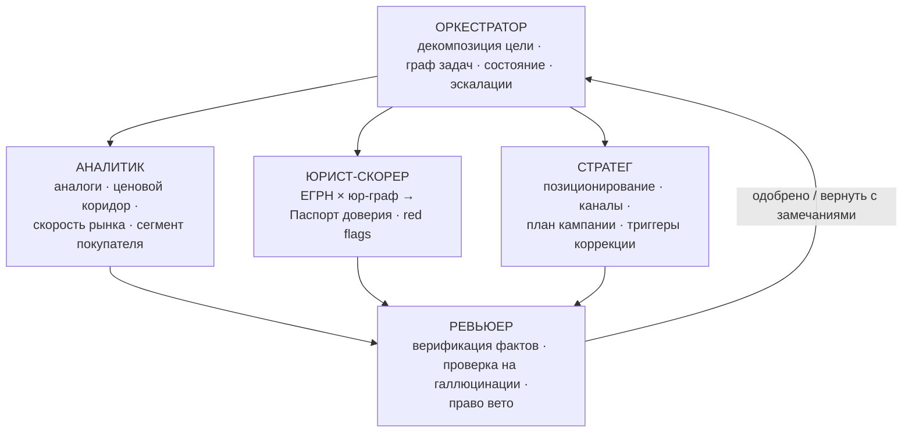
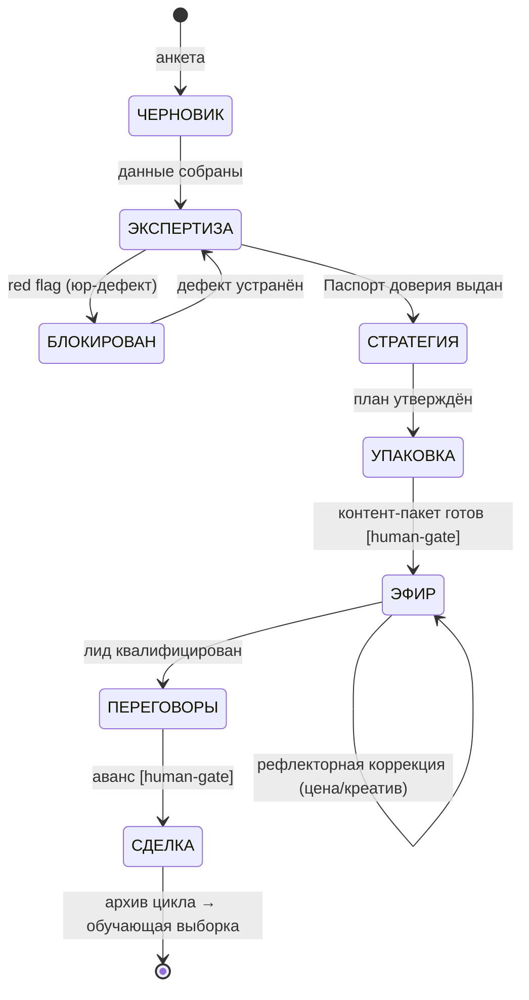
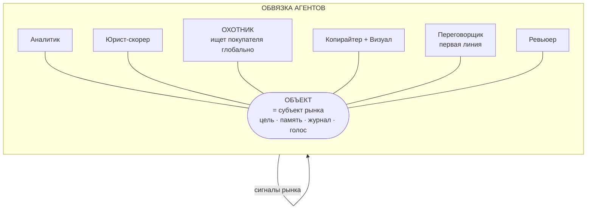
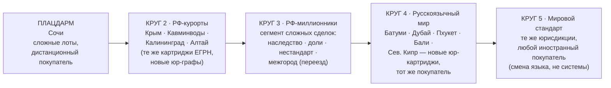

# AURA — Единый документ проекта
### Объект недвижимости становится субъектом рынка и продаёт себя сам — в обвязке агентов
**sochi.estate · Master v4.0 · август 2026**

---

## РАЗДЕЛ 0. О ДОКУМЕНТЕ

### 0.1. Назначение

Это **единственный источник истины** по проекту AURA. Всё, что было наработано в концептуальных сессиях (три ранних концепции + Master v2.0–v3.2), сведено сюда. Любое противоречие между версиями разрешается в пользу этого файла. Документ живой: обновляется по итогам каждой итерации, изменения фиксируются в changelog (Раздел 0.6).

### 0.2. Структура документа

| Блок | Содержание | Статус |
|---|---|---|
| **Раздел 0** | Навигация, каноническая сводка, история эволюции идеи | Канон |
| **Части I–VI** | Анализ рынка, технологий, УТП, архитектура семи слоёв, изобретения, план первого полёта | Канон (v2.0) |
| **Часть VII** | Переопределение ядра: объект-субъект, Охотник, картриджи | **Канон, высший приоритет** |
| **Части VIII–XII** | Штурм №2: законы архитектуры, эффект Медичи, дизайн, маркетинг, промпт Claude Code | Канон (v3.0) |
| **Части XIII–XIV** | Карта мировых решений, стратегия масштабирования | Канон (v3.1) |
| **Часть XV** | Питч-сессия «разнос и пересборка», 5 изменений проекта, Красная папка | Канон (v3.2) |
| **Приложение A** | Архив идей ранних концепций (не канон, банк идей на будущее) | Архив |
| **Приложение B** | Глоссарий проекта | Справочник |
| **Приложение C** | Правила работы с документом и проектом | Регламент |

**Правило приоритета:** при конфликте формулировок приоритет у более поздних частей: XV > XIII–XIV > VIII–XII > VII > I–VI > Приложения.

### 0.3. Каноническая сводка (проект на одной странице)

> **AURA — первая система, в которой объект недвижимости продаёт себя сам.**

**Инверсия отрасли.** Классический рынок: пассивный объект висит в витрине, покупатель ищет, риэлтор — дорогая (3–6%) человеческая обёртка над процессом. AURA переворачивает направление: **объект вычисляет своего покупателя и идёт к нему — глобально.** У объекта в системе есть цель (коридор цены × срок), состояние (конечный автомат), память (журнал жизни), голос (первая линия) и отчётность.

**Два несущих продукта (ультра-ценность = их произведение):**
1. **Паспорт доверия** — машиночитаемый сертификат объекта на данных ЕГРН + юр-граф локальных рисков. Отвечает на вопрос «почему найденный покупатель говорит "да" незнакомому объекту дистанционно». Два режима: «Знак» (публичный, для чистых объектов) и «Аудит» (приватный, с протоколом лечения → Клиника объектов). Клин монетизации: деньги в день 1.
2. **Охотник** — агент глобального поиска покупателя, работающий как разведцикл: портрет персон → карта обитания → экспедиции → обучение на отклике. Отвечает на вопрос «как объект находит покупателя где угодно».

**Архитектура:** семь герметичных слоёв (инфраструктура → сенсоры → знания → рассуждение → генерация → дистрибуция → взаимодействие, над всеми — управление и доверие). Оркестратор = Claude Code, агенты = субагенты-файлы, состояние = события в Postgres. Память принадлежит объекту, не агенту. Два контура: холодный (batch-анализ) и горячий (always-on первая линия 24/7).

**Масштабирование:** универсальное ядро + два сменных «картриджа территории» (юр-картридж, канальный картридж). Выход на новый рынок = недели и API-вызовы, не капитал.

**Плацдарм:** Сочи — «мягкий Северный полюс»: 70%+ нелокальных покупателей, дистанционные кэш-сделки, максимальная юридическая токсичность в стране, которую не детектирует ни один сервис. Докажем здесь — работает везде.

**Why now:** клетка «автономный продавец без человека в себестоимости и без недвижимости на балансе» пуста во всём мире — до агентных систем 2025–2026 её технически нельзя было занять.

**Монетизация:** паспорта (частотное ядро — покупательские пакеты 3/5/10 проверок) + success fee по факту сделки + Клиника объектов (протоколы лечения, партнёрская выручка). Ни одного рубля за «попытку».

**Ров:** юр-графы юрисдикций (полевые данные, которых нет в весах ни одной модели), журнал полных циклов сделок, стоимостная структура (себестоимость = API-вызовы), категориальное первенство.

**Дорожная карта — шкала автономности A0–A5:** от A2 (машина готовит, человек публикует) до A5 (полный автоном до нотариального действия). Каждый релиз = переход на уровень выше.

**Северная метрика текущей фазы:** выданные паспорта/неделю. **Критерий истины: события в журнале реальных объектов, а не документы.**

### 0.4. Текущее состояние проекта

- **Активы:** домен sochi.estate (лендинг-заглушка с фирменной анимацией сканирующих колец), репозиторий, три реальных объекта основателя как полигон, данный мастер-документ.
- **Фаза:** A2 (пред-запуск клина). Ни одного выданного паспорта, ни одного лида через систему — риск исполнения, не идеи (вердикт панели, Часть XV).
- **Ближайшие ворота:** тесты T1–T4 клина (проверка спроса на паспорт), аудит ToS площадок (R-3), сборка холодного контура по промпту Части XII.

### 0.5. История эволюции идеи (как мы сюда пришли)

Понимание траектории важно: она объясняет, почему канон таков, каков есть, и от чего мы осознанно отказались.

**Ступень 1 — «Автономное риэлторское агентство» (концепция №1).**
Исходный вопрос: «можно ли создать агентство, полностью работающее на ИИ-агентах?» Ответ: набор из 12 агентов на CrewAI (оценка, контент, фото, маркетинг, коммуникации, квалификация, показы, сделки, финансы, аналитика, реклама, CRM) с человеком-владельцем на стратегических решениях. **Почему ушли:** это автоматизация существующей профессии, а не новая категория. Центр системы — процесс риэлтора, а не объект.

**Ступень 2 — «AURA: цифровой двойник и рынок агентов» (концепция №1, развитие).**
Прорывная мысль: объект должен стать активным участником рынка. Object-First Architecture: каждый объект — «цифровая компания» со своим CEO-агентом; объекты общаются между собой (передают друг другу клиентов), над ними — иерархия Building/Developer/Regional/Market Agent. **Что взяли в канон:** объект как центральная сущность, память объекта. **Что отложили:** межобъектная экономика агентов и иерархия до города — красивая, но преждевременная надстройка (Приложение A.2).

**Ступень 3 — «Decision OS» (концепция №2).**
Смещение фокуса с агентов на решения: AURA = операционная система принятия решений, отвечающая не «что произошло?» (CRM), а «что сделать сегодня?». Появились: Knowledge Flywheel, принципы Object First / Human in Control / Explainable AI / Continuous Learning, «совет директоров» агентов с KPI и характерами, Mission как единица работы системы. **Что взяли в канон:** объяснимость каждого решения, human-gates, рефлекторная петля, накопление знаний как ров. **Что отложили:** «совет директоров» как продукт (в каноне — скромнее: Оркестратор + Ревьюер; дебаты агентов — гипотеза, Приложение A.3).

**Ступень 4 — «ORIGIN: платформа жизненного цикла» (концепция №3).**
Максимальное расширение: продажа — лишь 6 месяцев из 30 лет жизни объекта; платформа Sell OS / Rent OS / Invest OS / Manage OS...; Mission Engine как ядро; Constitution (культура агентов); Portfolio Intelligence с конкуренцией объектов за бюджет. **Почему свернули:** классическая ловушка «влюбиться в архитектуру» — платформенность до первого проданного объекта. **Что взяли в канон:** Jobs-To-Be-Done-формулировка работы системы, открытая архитектура (независимость от фреймворка). Остальное — банк идей (Приложение A.4).

**Ступень 5 — Master v2.0–v3.2 (текущий канон, Части I–XV).**
Возврат на землю через первые принципы: разбор рынка на атомы, анализ Ranker 3 и ЕГРН-API, семь слоёв, изобретения (Паспорт, шкала A0–A5, юр-граф, рефлекторная петля), переопределение ядра («объект-субъект в обвязке»), Охотник, картриджи, вскрытие Purplebricks, стратегия захвата, питч-сессия с пересборкой. Итоговая формула: **амбиция единорога, исполняемая с бюджетом ~0 и проверяемая журналом, а не документами.**

### 0.6. Changelog

| Версия | Дата | Изменения |
|---|---|---|
| v4.0 | авг 2026 | Консолидация: Master v3.2 + архив трёх ранних концепций + навигация, сводка, глоссарий, регламент. Единый файл для репозитория. |
| v3.2 | июл 2026 | Питч-сессия: 5 изменений проекта, Красная папка R-1…R-5 |
| v3.1 | июл 2026 | Части XIII–XIV: карта мировых решений, стратегия захвата |
| v3.0 | июл 2026 | Штурм №2, эффект Медичи, дизайн-философия, маркетинг, промпт Claude Code |
| v2.1 | июл 2026 | Переопределение ядра: объект-субъект, Охотник, картриджи |
| v2.0 | июл 2026 | Первые принципы: рынок, технологии, УТП, семь слоёв |

---
---

# КАНОНИЧЕСКОЕ ЯДРО (Части I–XV, наследие Master v2.0 → v3.2)

> Документ строится по логике изобретателя: сначала разобрать реальность на атомы (Часть I–II), из атомов вывести то, чего не существует (Часть III — УТП), затем спроектировать машину, которая это реализует (Часть IV — архитектура), и назвать изобретения своими именами (Часть V).

---

# ЧАСТЬ I. ГЛУБОКИЙ АНАЛИЗ РЫНКА

## 1.1. Три волны PropTech: чему учит мировая история

**Волна 1 — Классифайды (2000–2015): продажа внимания.**
Zillow, Realtor, Cian. Модель: собрать все объявления, продавать доступ к аудитории. Объект — пассивная строчка в каталоге. Риэлтор никуда не делся, классифайд лишь дал ему витрину. Экономика посредника не тронута.

**Волна 2 — iBuying (2015–2024): продажа ликвидности. Провал капиталоёмкой модели.**
Opendoor: алгоритм оценивает дом, компания выкупает его на баланс, ремонтирует, перепродаёт. Итог десятилетия: Zillow полностью вышел из iBuying, потеряв сотни миллионов; Opendoor в 2025 пережил клиническую смерть (акции ниже $1, списания запасов, падение выручки на 33%) и в 2026 радикально разворачивается — от владения инвентарём к **asset-light AI-маркетплейсу**: «software-and-AI-first», андеррайтинг оффера сокращён с часов до <10 минут, цель — операционная система сделки, а не владелец домов.

**Урок №1 (фундаментальный): рынок наказал тех, кто взял на баланс недвижимость, и вознаграждает тех, кто владеет только интеллектом и данными.** Даже пионер iBuying мигрирует в ту точку, откуда мы стартуем изначально: лёгкая система, ноль активов, вся ценность — в ИИ-слое.

**Волна 3 — AI-native (2024–...): продажа результата. Открытое окно.**
2026 — год, когда агентные ИИ-процессы переходят из демо в ежедневную производственную практику, и недвижимость названа среди первых отраслей внедрения. Рынок ИИ в недвижимости оценивался в $222,6 млрд (2024) с прогнозом роста ~35% в год. Но посмотри, **что именно** делают лидеры:
- Zillow: ML-оценка (Zestimate) + персональный подбор → **инструмент покупателя**
- Compass: ИИ в платформе агента (лиды, прайсинг, workflow) → **инструмент риэлтора**
- Opendoor: ИИ-андеррайтинг и автоматизация транзакции → **инструмент сделки**
- Девелоперы РФ: чат-боты, речевая аналитика звонков, генерация описаний → **инструменты отделов продаж**

Никто не строит **инструмент объекта**. Во всех моделях мира объект остаётся товаром, вокруг которого суетятся люди с ИИ-инструментами. Ни одна система не сделала сам объект носителем стратегии, бюджета и воли к продаже. Это не риторика — это структурная дыра третьей волны, и она видна только если смотреть с первых принципов.

## 1.2. Российский рынок: анатомия цепочки создания стоимости



**Где концентрируется маржа:** у риэлтора (3–6% от сделки; при средней сделке в Сочи 20–40 млн ₽ это 0,6–2,4 млн ₽ за транзакцию). **Где концентрируется власть:** у классифайдов (топ-10 позиций выдачи Авито собирают до 60% всех просмотров). **Где концентрируется риск:** у собственника и покупателя (юридическая непрозрачность, конфликт интересов риэлтора, работающего «на обе стороны»).

**Контекст роста:** российский PropTech превысил 55 млрд ₽ (против 39 млрд в 2023). Тренды-2026 по опросам девелоперов: персонализация на данных клиента (75%), виртуальные ассистенты и предикция поведения покупателя (50%). Закон о единой биометрической системе легализовал полностью дистанционные сделки с недвижимостью — юридический фундамент для сделки без физического посредника уже существует.

**Классифайды (наша среда дистрибуции):**
- **Авито** — абсолютный лидер охвата в городах 100k+;
- **Циан** — доминирует в Москве/СПб (среда обитания целевого покупателя курортной недвижимости);
- **Домклик** — крупнейший объём объявлений + ипотечная воронка Сбера (>50% ипотек страны);
- **Яндекс.Недвижимость** — третий по доле.
Ни один не даёт открытого API публикации частным лицам — вся отрасль размещается руками. Это ограничение, но одинаковое для всех, а значит — не ограничение, а поле, где выигрывает лучшая подготовка пакета.

## 1.3. Ключевое открытие: рынок внимания уже алгоритмизирован — но никто не играет в него машиной

Разбор Avito Ranker 3 (действующий алгоритм, ML-модель, 100+ факторов):
- Трёхступенчатый пайплайн: отбор кандидатов → ML-ранжирование → персонализация под покупателя;
- Решающие сигналы: **CTR карточки** (клики после показа), **глубина просмотра**, **доля переходов в чат**, **добавления в избранное**, **скорость ответа продавца** (идеал <5 минут; задержка 20–30 минут уже роняет позиции; час — аккаунт помечается неактивным), рейтинг, цена относительно аналогов;
- Платное продвижение — только умножитель: слабая карточка с X10 падает **быстрее**, потому что алгоритм видит низкую конверсию оплаченных показов;
- Время публикации больше не двигает карточку — эра «поднятий» закончилась, началась эра качества сигналов.

**Что это означает на первых принципах:** выдача классифайда — это торги за поведенческие метрики, то есть **задача оптимизации**. Люди (риэлторы) решают её интуицией и бюджетом. Машина решает её измерением и итерацией: A/B заголовков и обложек, ответ в чате за секунды (не минуты — секунды, 24/7), непрерывная подстройка цены к аналогам. **Автономная система структурно превосходит человека по каждому решающему фактору Ranker 3.** Это не гипотеза — это прямое следствие устройства алгоритма.

## 1.4. Инфраструктура истины: ЕГРН доступен машинам

Критический факт для архитектуры: данные Росреестра доступны программно. Существуют API-провайдеры сведений ЕГРН (поиск по адресу → кадастровый номер → характеристики, кадастровая стоимость, права/обременения) с ценой порядка ~2 ₽ за источник данных и бесплатными тестовыми тарифами (100–200 запросов/мес). С 2023 года ФИО собственников-физлиц закрыты (выдаются с их согласия) — но для собственника, продающего свой объект, это не барьер: он раскрывает данные сам.

**Следствие:** автоматическая юридическая экспертиза объекта — назначение (жилое/нежилое), обременения, аресты, кадастровая стоимость, история — реализуема программно и почти бесплатно. Ни классифайды, ни риэлторы не делают её стандартной частью каждого объявления. Проверка юридической чистоты сегодня — платная опция «где-то сбоку», а не свойство самого лота.

## 1.5. Микрорынок Сочи: почему полигон выбран правильно

- Рынок в фазе коррекции и «жёсткой логики»: сделки в новостройках падали на 40–58% г/г, акционные цены опустились до ~300 тыс. ₽/м² при прежних ориентирах 400–450 тыс.; вторичка ~415 тыс. ₽/м², динамика разнонаправленная — **решает конкретный объект, а не рынок**.
- Ипотека сжата ставкой → курортная недвижимость покупается за живые деньги → покупатель нелокальный (70%+ приезжие, ядро — Москва), сделка и так дистанционная и цифровая.
- Покупатель стал требователен к **документам, состоянию, цене** — качественные лоты по нижней границе рынка выкупаются за недели, остальное висит.
- Юридическая токсичность максимальна в стране: мансарды с нежилым статусом в ЕГРН, самострои в реестре на снос, ИЖС-доли по судебным решениям. **Ни один российский сервис не детектирует сочинские риски автоматически** — подтверждённое белое пятно.

**Логика полигона:** если автономная система докажет себя на самом юридически токсичном, самом дистанционном и самом придирчивом рынке страны — она докажет себя везде. Сочи — это не «маленький региональный рынок», это **стресс-тест максимальной сложности**, пройдя который система масштабируется вниз по сложности (обычные города) и вбок (другие «токсичные» курортные юрисдикции: Крым, Кавминводы, затем международные ниши).

## 1.6. Карта боли по акторам (где спрятана энергия рынка)

| Актор | Боль | Готовность платить |
|---|---|---|
| Собственник | Комиссия 0,6–2,4 млн ₽; непрозрачность («что риэлтор вообще делает?»); объект висит месяцами без обратной связи | Высокая: платит уже сейчас, вопрос — кому и за что |
| Покупатель (Москва, кэш) | Страх юридической мины при дистанционной покупке; недоверие к фото; невозможность проверить лот самостоятельно | Высокая: юр-проверка = страховка сделки на десятки млн |
| Риэлтор | Рутина: тексты, фото, публикации, звонки-пустышки | Не наш клиент; в перспективе — пользователь инструментов системы |
| Классифайд | Фейки и «мёртвые» объявления снижают доверие к платформе | Стратегический союзник: верифицированные лоты повышают качество их выдачи |

Энергия рынка (деньги + мотивация) сосредоточена на полюсах «собственник» и «покупатель», а весь сервисный слой между ними — рутина, уже автоматизируемая ИИ. Рынок заряжен как конденсатор; нужен проводник.

---

# ЧАСТЬ II. ГЛУБОКИЙ АНАЛИЗ ТЕХНОЛОГИЙ

## 2.1. Агентные системы 2026: состояние искусства

Индустрия прошла фазовый переход. Запросы на мультиагентные системы выросли на ~1445% за 2025 год; 57% организаций уже запускают многошаговые агентные процессы в продакшене. Ключевые выводы инженерной практики, которые мы берём как законы проектирования:

**Закон 1. Один агент — потолок.** Единый универсальный агент упирается в лимиты контекста, теряет зависимости и деградирует на сложных задачах. Мультиагентные архитектуры с координатором показывают прирост точности +70% (LangGraph-замеры), а исследовательская архитектура с параллельными субагентами и ведущим планировщиком превосходила одиночную сильную модель на 90%.

**Закон 2. Оркестрация > хореография.** Центральный оркестратор (планировщик, управляющий графом задач, состоянием и наблюдаемостью) даёт контроль и отлаживаемость; свободное общение агентов между собой порождает хаос. Роли должны быть острыми и непересекающимися: «команда, где каждый знает, где кончается его работа и начинается чужая».

**Закон 3. Ревьюер обязателен.** Паттерн feedback loop: один агент проверяет выход другого (факт-чекер, юр-верификатор). Это главный инженерный ответ на галлюцинации — критично для домена, где ошибка в юридическом факте стоит сделки.

**Закон 4. Ярусность моделей.** Дешёвые быстрые модели — на маршрутизацию и рутину, сильные — на рассуждения. Экономия 40–60% затрат. Для нас при нулевом бюджете это не оптимизация, а условие выживания.

**Закон 5. Состояние — священно.** Иммутабельные снапшоты состояния, event sourcing, полный аудит-трейл, идемпотентные инструменты, circuit breakers и kill-switch. Автономия без определённых границ полномочий «усиливает хаос, а не масштаб».

**Закон 6. MCP — стандарт стыковки.** Model Context Protocol стал де-факто стандартом интеграции агентов с внешними системами. Проектируя слои как MCP-совместимые, мы получаем будущие интеграции (агрегаторы, CRM, банки) бесплатно — когда они откроются.

## 2.2. Технологический стек по способностям (что машина умеет в 2026)

| Способность | Зрелость | Наш доступ (бюджет ~0) |
|---|---|---|
| Рассуждение и стратегия (LLM) | Производственная | Claude / Claude Code |
| Глубокий поиск и анализ рынка | Производственная | Perplexity (подписка есть) |
| Социальные сигналы, тренды | Рабочая | Grok (подписка есть) |
| Фотореалистичные рендеры интерьеров | Производственная | Midjourney/DALL-E/Kandinsky |
| Дизайн-производство (презентации, каталоги) | Производственная | Canva (подписка есть) |
| Структурированные данные + события | Производственная | Supabase free tier (Postgres) |
| Векторная память / семантический поиск | Производственная | pgvector внутри той же Supabase |
| Программный доступ к ЕГРН | Производственная | API-провайдеры, ~2 ₽/запрос |
| Автопубликация на классифайды | **Отсутствует** (нет открытых API) | Human-in-the-loop: система готовит пакет, человек публикует |
| Мгновенный ответ покупателю 24/7 | Производственная | Бот + LLM (в рамках правил площадок) |
| Дистанционная сделка | Легализована (биометрия) | Партнёрство с банком/нотариусом — поздняя фаза |

**Вывод:** из всего конвейера продажи недвижимости технологически недоступно ровно одно звено — автоматическая публикация. Всё остальное — от юридической экспертизы до переговоров первой линии — исполнимо машиной уже сегодня на бесплатных или копеечных инструментах. Значит, архитектура строится полностью автономной, с одним документированным «ручным клапаном», который закроется, когда появятся API/MCP-мосты.

## 2.3. Чего не хватает всем существующим решениям (технологическая дыра)

Существующие ИИ-продукты в недвижимости — это **наборы инструментов** (генератор описаний, чат-бот, оценщик), вызываемые человеком. Ни один не является **системой с целью**: с собственным состоянием, петлёй обратной связи и правом инициативы. Разница фундаментальна:

- Инструмент: «сгенерируй описание» → результат → человек думает, что дальше.
- Система с целью: «объект X должен быть продан в коридоре Y за срок Z» → система сама декомпозирует, исполняет, измеряет отклик рынка, корректирует и отчитывается.

Вторая категория в недвижимости пуста. В этом технологический смысл проекта.

---

# ЧАСТЬ III. СИНТЕЗ: УТП (от 0 к 1)

## 3.1. Продажа недвижимости, разобранная на атомы

По первым принципам сделка с недвижимостью сводится к пяти атомам:

1. **ИСТИНА** — что юридически и физически представляет собой объект;
2. **ЦЕНА** — точка, где спрос встречает предложение;
3. **ВНИМАНИЕ** — глаза целевого покупателя на объекте;
4. **ДОВЕРИЕ** — готовность покупателя перевести десятки миллионов незнакомцу;
5. **ТРАНЗАКЦИЯ** — юридический перенос права.

Риэлтор — это дорогая (3–6%) человеческая обёртка над атомами 1–4. Теперь наложим технологии 2026 на атомы:

| Атом | Кто закрывает сегодня | Чем закрывается машиной |
|---|---|---|
| Истина | «со слов собственника» | ЕГРН-API + юр-граф локальных рисков |
| Цена | интуиция риэлтора | анализ аналогов + отклик рынка в реальном времени |
| Внимание | бюджет + интуиция | оптимизация под ML-ранжирование (Ranker 3 и аналоги) |
| Доверие | «я 15 лет на рынке» | верифицируемые данные + прозрачный аудит-трейл |
| Транзакция | юрист/нотариус/банк | биометрия + электронная регистрация (уже закон) |

Каждый атом либо уже автоматизирован, либо автоматизируем на доступных нам инструментах. Профессия-обёртка держится на инерции, а не на незаменимости. Это и есть «секрет» в терминах Тиля.

## 3.2. Формулировка УТП

> **AURA — первая система, в которой объект недвижимости продаёт себя сам.**
> Каждому объекту присваивается автономный цифровой субъект: он устанавливает юридическую истину о себе (машиночитаемый Паспорт доверия на данных ЕГРН), вычисляет цену по живому отклику рынка, завоёвывает внимание, играя в алгоритмы площадок лучше любого человека, и отчитывается собственнику фактами, а не обещаниями. Стоимость — кратно ниже комиссии риэлтора, прозрачность — абсолютная.

Три опоры УТП, каждая — против одного типа конкурента:
1. **Против классифайдов** («продают внимание»): мы продаём результат, внимание — лишь наш расходный материал.
2. **Против риэлторов** («продают руки и связи»): мы продаём превосходство в каждом измеримом факторе сделки — скорость ответа в секундах, экспертиза из первоисточника (ЕГРН), цена из данных.
3. **Против ИИ-инструментов** («продают функции»): мы продаём автономию — систему с целью, а не кнопку.

## 3.3. Ров (moat): почему нас нельзя быстро скопировать

1. **Юридический граф локального рынка.** База паттернов рисков конкретной юрисдикции (типовые схемы мансард, реестры сноса, судебные ИЖС-доли) собирается только полевой работой на реальных объектах. Это данные, которых нет ни у кого, и они накапливаются с каждым обработанным лотом. Главный актив.
2. **Данные полных циклов.** Каждый проданный объект оставляет системе полный след: какие заголовки дали CTR, какие цены дали лиды, сколько дней занял каждый этап. Классифайд видит только свою витрину; риэлтор не записывает ничего. Мы видим весь цикл — это обучающая выборка, которой не существует больше нигде.
3. **Стоимостная структура.** Себестоимость обслуживания объекта у нас стремится к стоимости API-вызовов. Агентство с офисом и штатом не может опуститься в нашу ценовую точку, не разрушив себя.
4. **Категориальное первенство.** «Первая система, где объект продаёт себя сам» — позиция, которую нельзя занять вторым.

---

# ЧАСТЬ IV. АРХИТЕКТУРА СИСТЕМЫ: СЕМЬ СЛОЁВ

Проектируем как космический корабль: каждый слой — герметичный отсек со своей функцией, чётким контрактом с соседями и автономной живучестью. Отказ одного слоя не убивает корабль — система деградирует изящно (graceful degradation), а не падает.



## Слой 0 — Инфраструктура (корпус корабля)
- **Postgres (Supabase free)** — единственный источник структурированной истины. **pgvector** в той же базе — семантическая память (никакого второго облака).
- **Статический хостинг** (Cloudflare Pages/Vercel, 0 ₽) — сайт-хаб.
- **MCP-шина**: каждый внешний сервис (ЕГРН-API, Telegram, будущие агрегаторы) подключается как MCP-сервер. Слои не знают деталей внешнего мира — только контракты. Когда агрегаторы откроют API, заменится один адаптер, а не система.
- **Секреты и доступы** — централизованно, вне кода.
- *Принцип отсека:* инфраструктура не содержит бизнес-логики. Её можно целиком заменить, не переписав ни одного агента.

## Слой 1 — Сенсоры (органы чувств)
Каналы восприятия мира, каждый — независимый датчик:
1. **Анкета собственника** — первичный ввод (структурированный опрос, 30+ полей);
2. **ЕГРН-детектор** — программный запрос: назначение, обременения, кадастровая стоимость, площадь. *Правило: данные собственника — гипотеза; данные ЕГРН — факт. Расхождение = событие тревоги.*
3. **Рыночный радар** — регулярный сбор аналогов с площадок: цены, дни экспозиции, плотность конкуренции (Perplexity + парсинг открытых выдач);
4. **Телеметрия дистрибуции** — просмотры, CTR, контакты, избранное по каждому нашему объявлению (ручной ввод еженедельно → парсинг позже);
5. **Социальный сейсмограф** — сигналы спроса и настроений (Grok, Telegram-каналы).
- *Контракт слоя:* каждый датчик пишет **события** (не перезаписывает состояние!) в Журнал жизни объекта: `observed_at, source, payload, confidence`.

## Слой 2 — Знания (память корабля)
Двухполушарная память:
- **Левое полушарие — структурное (Postgres):**
  - `objects` — паспорт объекта (физика: метры, этажи, адрес);
  - `legal_profile` — юридический профиль (статус, обременения, риски, вердикты);
  - `events` — иммутабельный журнал жизни: каждое наблюдение, решение, публикация, лид, изменение цены. **Event sourcing: состояние объекта в любой момент = свёртка его событий.** Это одновременно аудит-трейл (Закон 5) и обучающая выборка (ров №2).
  - `listings`, `leads`, `price_history`, `experiments` (A/B заголовков и обложек).
- **Правое полушарие — семантическое (pgvector + Obsidian):**
  - **Юридический граф Сочи** — паттерны рисков: «мансарда + свидетельство до 2016 → проверить назначение в ЕГРН», «литер X → реестр сноса». Каждый паттерн: признак-триггер → проверка → следствие → стратегия. *Это главный накапливаемый актив системы (ров №1).*
  - **Плейбуки** — стратегии продаж по типам объектов и покупателей;
  - **База знаний площадок** — актуальные правила ранжирования, лимиты, форматы (то, что мы выяснили про Ranker 3, живёт здесь и обновляется).
- *Контракт слоя:* знания версионируются; агенты читают всё, пишут только через события.

## Слой 3 — Рассуждение (мозг, мультиагентное ядро)
Иерархическая оркестрация (Закон 2), острые непересекающиеся роли:



- **Оркестратор** ведёт каждый объект по конечному автомату жизненного цикла (ниже) и решает, какой специалист нужен на каждом переходе.
- **Ревьюер** (Закон 3) — отдельный агент с единственной функцией: проверять выходы других на соответствие фактам из Слоя 2. Ни один юридический факт и ни одна цена не проходят к публикации без его визы. Ошибка юр-факта = катастрофа доверия, поэтому здесь избыточность, как в системах жизнеобеспечения.
- **Ярусность моделей** (Закон 4): рутинная маршрутизация — лёгкая модель; рассуждения Аналитика/Стратега — сильная. 
- *Контракт слоя:* решения выражаются только как события с обоснованием (`decision, rationale, inputs, confidence`) — мозг, который можно допросить.

**Конечный автомат жизненного цикла объекта:**


## Слой 4 — Генерация (производственный цех)
- **Копирайтер**: из одного паспорта объекта — N версий под каждую площадку, оптимизированных под её ранжирование (семантика заголовка под запросы, структура под глубину чтения, первая фраза под CTR). Каждый текст рождается с вариантом Б — для A/B.
- **Визуал-агент**: пайплайн рендеров (промпт-паки EN/RU уже наработаны), правила первой обложки (главный фактор CTR), инфографика в карусель.
- **Лендинг-генератор**: страница объекта на sochi.estate с блоком Паспорта доверия — то, чего нет ни на одной площадке.
- *Контракт слоя:* генерирует только из верифицированных данных Слоя 2. Ни одного факта «от себя». Выход — версионированный `content_package`.

## Слой 5 — Дистрибуция (двигательная установка)
- **Мультиплощадочная публикация**: система формирует идеальный пакет под каждую площадку + чек-лист; человек исполняет за ~10 минут (единственный ручной клапан, см. 2.2). Каждая публикация регистрируется событием.
- **Движок ранжирования**: непрерывная игра в алгоритм площадки на измеримых факторах — CTR-эксперименты (обложка/заголовок), дисциплина цены относительно аналогов, каденция обновлений. Здесь система реализует структурное превосходство из 1.3.
- **Хаб sochi.estate**: SEO-актив, дом Паспортов доверия, точка сбора прямых лидов в обход комиссий площадок в перспективе.
- *Контракт слоя:* отдаёт телеметрию в Слой 1 — замыкает рефлекторную петлю.

## Слой 6 — Взаимодействие (голос корабля)
- **Первая линия**: мгновенные ответы на типовые вопросы покупателей (фактология из Паспорта, условия просмотра) — целимся в фактор «скорость ответа <5 минут» круглосуточно;
- **Лид-скоринг**: квалификация (бюджет, срок, ипотека/кэш) → горячие эскалируются человеку;
- **Отчёт собственнику**: еженедельно, только факты из событий: показы, CTR vs рынок, лиды, действия, следующие шаги. Прозрачность как продукт — прямой удар в главную боль собственника («что вообще происходит с моим объектом?»).
- *Контракт слоя:* никогда не выдумывает; на вопрос вне Паспорта отвечает «уточню» и создаёт задачу.

## Слой 7 — Управление и доверие (центр управления полётом)
- **Границы автономии и human-gates** — см. шкалу A0–A5 в Части V; критические переходы (публикация цены, юр-заявления, аванс) проходят подпись человека, пока уровень автономии не повышен явным решением;
- **Аудит-трейл** — уже встроен архитектурно (event sourcing): любое решение системы можно развернуть до входных данных;
- **Kill-switch** — снятие объекта со всех витрин одной командой;
- **Политики** — что системе запрещено всегда (обещания без данных, давление на покупателя, работа с объектом без Паспорта доверия).
- *Принцип:* доверие — не маркетинговый слой поверх системы, а её инженерное свойство. Мы строим систему, которой можно доверить сделку на десятки миллионов, — значит, доказуемость каждого шага заложена в фундамент, как чёрный ящик в самолёт.

---

# ЧАСТЬ V. ИЗОБРЕТЕНИЯ (то, чего не существовало)

**1. Паспорт доверия (Trust Passport).**
Машиночитаемый и человекочитаемый сертификат объекта: назначение по ЕГРН, обременения, соответствие заявленного фактическому, прогон через юр-граф локальных рисков, дата верификации. Живёт на лендинге объекта, ссылка — в каждом объявлении. Превращает атом «доверие» из обещания в артефакт. Потенциально — отдельный продукт (покупателям, банкам, даже площадкам).

**2. Шкала автономности продажи A0–A5.**
Собственная рамка (по образцу уровней автономности беспилотных автомобилей) — язык, на котором проект говорит с собственниками, инвесторами и самим собой:
- **A0** — всё делает человек (риэлтор сегодня);
- **A1** — машина ассистирует (генераторы описаний — потолок нынешнего рынка);
- **A2** — машина готовит, человек исполняет (наш старт: полный пакет + ручная публикация);
- **A3** — машина исполняет, человек утверждает гейты (цена, публикация, аванс);
- **A4** — машина ведёт цикл, человек наблюдает и вмешивается по исключениям;
- **A5** — полный автоном до момента нотариального действия.
Каждый релиз системы = переход объекта на уровень выше. Дорожная карта продукта и питч инвестору в одной шкале.

**3. Объект как субъект.**
У объекта в системе есть цель (коридор цены × срок), состояние (конечный автомат), память (журнал жизни), голос (первая линия) и отчётность. Инверсия всей отрасли: не люди с инструментами вокруг товара, а субъект с людьми на гейтах.

**4. Юридический граф локального рынка.**
Накапливаемая машиночитаемая карта рисков юрисдикции. Каждый обработанный объект обогащает граф → каждый следующий объект проверяется лучше → системный эффект маховика. Актив, который нельзя купить — только накопить.

**5. Рефлекторная петля рынка.**
Замкнутый контур восприятие→действие (как у робота): телеметрия площадок (Слой 1) → интерпретация (Слой 3) → коррекция креатива/цены (Слои 4–5) → новая телеметрия. Объявление перестаёт быть статичным текстом и становится адаптивным организмом. Правило по умолчанию: 14 дней без лидов → пересмотр гипотезы цены/креатива с обоснованием.

---

# ЧАСТЬ VI. СВЁРТКА: ОТ АРХИТЕКТУРЫ К ПЕРВОМУ ПОЛЁТУ

Архитектура семи слоёв — карта всего корабля. Строится он по закону Маска (автоматизация — последней) через уровни автономии:

- **Итерация 1 (уровень A2):** Слои 0–2 полностью (база, сенсоры, память с юр-графом) + Слой 3 в ручном режиме диалога с Claude Code + Слой 4 генерация + ручная публикация. Уже на A2 система превосходит рынок: ни один риэлтор не выходит на площадку с Паспортом доверия и пакетом, оптимизированным под ML-ранжирование.
- **Итерация 2 (уровень A3):** автоматизация рефлекторной петли, первая линия в Telegram, автоотчёты.
- **Итерация 3 (уровень A4):** оркестратор ведёт цикл сам; человек — только на гейтах. Юр-скоринг выделяется в отдельный продукт.
- **Итерация 4 (A4→A5, масштаб):** MCP-мосты к площадкам по мере открытия API, вторая юрисдикция (перенос архитектуры, замена юр-графа), внешние объекты, финансирование под доказанную экономику.

Критерий истины на каждом шаге один: **события в журнале реальных объектов**, а не документы. Этот документ — последний, который мы пишем до того, как система начнёт писать свой журнал сама.

---
*Диаграммы: Mermaid. Документ живой — обновляется по итогам каждой итерации.*

---

# ЧАСТЬ VII. ПЕРЕОПРЕДЕЛЕНИЕ ЯДРА (v2.1 — по итогам штурма и дискуссии)

## 7.1. Каноническая формулировка

> **Объект недвижимости становится субъектом рынка и работает сам — в обвязке агентов.**

Это не метафора, а техническое определение системы. «Обвязка» (по аналогии с обвязкой скважины или реактора) — постоянный контур агентов, смонтированный вокруг объекта в момент его поступления в систему и работающий, пока объект не продан:



## 7.2. Инверсия отрасли: объект охотится на покупателя

Вся классическая недвижимость устроена пассивно: объект вывешивается в локальную витрину и ждёт, пока его найдут. AURA обращает направление поиска:

**Не покупатель ищет объект — объект вычисляет своего покупателя и идёт к нему. Глобально.**

Мысленный эксперимент-предел («тест Северного полюса»): объект в точке, где нет ни одной местной витрины, продаваем тогда и только тогда, когда система умеет ответить на вопрос «кто на Земле его покупатель и где он обитает» — и дотянуться туда. Система, проходящая тест Северного полюса, по построению работает в любой точке планеты. Агрегаторы при этом взгляде — не среда обитания, а лишь один из каналов охоты.

Роль **Охотника** (новый агент обвязки): портрет покупателя из свойств объекта → карта мест его обитания (площадки, сообщества, ниши, гео) → доставка объекта туда → обучение на отклике.

## 7.3. Универсальный движок + картриджи территории

Декомпозиция «магии» по зависимости от локации:

| Модуль | Зависимость от места |
|---|---|
| Анализ объекта, стратегия, портрет покупателя | 0% — универсально |
| Упаковка: тексты, рендеры, лендинг | 0% — универсально |
| Охота: вычисление и достижение покупателя | ~10% — универсальная логика, локальные адреса |
| Переговоры, отчётность, рефлекторная петля | 0% — универсально |
| Юридическая истина | **картридж** (реестр + граф рисков юрисдикции) |
| Локальные каналы дистрибуции | **картридж** (адаптеры площадок) |

Ядро инвариантно; территория — два сменных картриджа. Выход на новый рынок = разработка двух картриджей, не системы. (Архитектурно: картриджи целиком живут в Слоях 1–2; Слои 3–7 не меняются.)

## 7.4. Два уровня одной системы (склейка с итогом штурма)

- **ОХОТНИК** отвечает на вопрос *КАК объект находит покупателя где угодно* — двигатель.
- **ПАСПОРТ ДОВЕРИЯ** отвечает на вопрос *ПОЧЕМУ найденный покупатель говорит «да» незнакомому объекту дистанционно* — стыковочный узел.

Охота без доверия приводит людей, которые боятся платить. Доверие без охоты сидит без людей. Ультра-ценность = произведение двух уровней.

## 7.5. Градиент силы системы

Ценность обвязки растёт с уникальностью и нестандартностью объекта: типовую ликвидную квартиру продаёт и Авито; уникальный, сложный, «непонятный» лот без глобальной охоты и верифицированного доверия не продаётся вовсе. Следствие для стратегии: система входит в рынок с трудных объектов (там её преимущество максимально и монопольно) и спускается к массовым по мере автоматизации. Сочи — «мягкий Северный полюс» (70%+ нелокальных покупателей, нестандартный фонд) — остаётся идеальным первым полигоном, но полигоном универсальной машины, а не региональным бизнесом.

*Конец v2.1. Части I–VI остаются в силе; при конфликте формулировок приоритет у Части VII.*

---
---

# MASTER v3.0 — СЕССИЯ «ЕДИНОРОГ»
*Части VIII–XII. Штурм №2: архитектура обвязки · Эффект Медичи · Дизайн-философия · Маркетинг · Промпт Claude Code*

---

# ЧАСТЬ VIII. ШТУРМ №2 — АРХИТЕКТУРА ОБВЯЗКИ И ПРОДУКТ

Штаб тот же (8 ролей). Предмет: как именно строится обвязка агентов на передовом стеке 2026 и что из этого видит клиент. Формат: тезис → контраргумент → решение (фиксируется как закон проекта).

## 8.1. Дебаты об оркестрации: фреймворк или Claude Code?

⚙️ ТЕХНАРЬ: «Передовой стек 2026 — это графовые оркестраторы (LangGraph и аналоги): узлы-агенты, рёбра-переходы, персистентное состояние. Предлагаю строить на нём.»

🔪 СКЕПТИК: «Возражаю жёстко. Основатель — не программист. Графовый фреймворк = месяцы борьбы с чужой абстракцией и отладкой на Python. Проект умрёт в туториалах. И главное: фреймворк не даёт ничего, чего нельзя получить проще.»

⚙️ ТЕХНАРЬ: «Контр-предложение, снимающее спор: **Claude Code и есть оркестратор.** В 2026 это полноценная агентная платформа: субагенты (`.claude/agents/` — каждый агент = markdown-файл с ролью, инструментами и правами), слэш-команды как процедуры, hooks как автоматика, MCP как шина внешнего мира. Состояние держим не в памяти процесса, а в Postgres-событиях (Слой 2) — оркестратор может умереть и возродиться, объект ничего не заметит. Это и есть передовой паттерн: durable state вне рантайма.»

💰 ИНВЕСТОР: «И это же ответ инвестору на вопрос "какой у вас burn на инженерию": ноль. Вся команда разработки — подписка на Claude.»

**⚖ ЗАКОН 8.1:** Оркестратор = Claude Code. Агенты обвязки = субагенты (файлы-роли). Состояние = события в Postgres. Никаких фреймворков, пока живой процесс не потребует их сам (правило Маска: не автоматизируй чужой абстракцией то, что не пощупал руками).

## 8.2. Дебаты об анатомии обвязки: один мозг или экипаж?

🎯 СТРАТЕГ: «Обвязка на объект — это "инстанс" всех агентов? Дорого и хаотично при 100 объектах.»

⚙️ ТЕХНАРЬ: «Разделяем СУЩНОСТЬ и ИСПОЛНЕНИЕ. Сущность обвязки — это досье объекта в Слое 2 (паспорт, стратегия, журнал, состояние конечного автомата). Исполнение — общий пул субагентов, которые "надеваются" на досье по вызову оркестратора. Аналогия: не личный экипаж у каждого самолёта, а лётный состав авиакомпании, принимающий любой борт по его журналу. Объект остаётся субъектом (его цель, память и журнал уникальны), агенты — сменный персонал.»

🔪 СКЕПТИК: «Тогда где гарантия, что "сменный персонал" не потеряет контекст объекта?»

⚙️ ТЕХНАРЬ: «Контекст живёт не в агенте, а в досье: агент обязан начинать любую работу с чтения журнала объекта и заканчивать записью события. Агент без побочной памяти — stateless worker над stateful объектом. Это инженерно чище и это буквально воплощение тезиса "объект — субъект": память принадлежит объекту, не работнику.»

**⚖ ЗАКОН 8.2:** Память — у объекта, руки — общие. Каждый акт работы агента = транзакция «прочитал журнал → сделал → записал событие с обоснованием».

## 8.3. Дебаты об Охотнике: как технически «объект ищет покупателя»?

📣 МАРКЕТОЛОГ: «"Охотник" звучит красиво, но что он ДЕЛАЕТ в понедельник утром?»

⚙️ ТЕХНАРЬ: «Конвейер из четырёх шагов, каждый — исполним на нашем стеке сегодня:
1. **Портрет** — из свойств объекта LLM выводит 3–5 гипотез персон покупателя (кто, зачем, на какие деньги, чего боится);
2. **Карта обитания** — для каждой персоны: где она физически читает/сидит/ищет (площадки, TG-каналы, сообщества, поисковые запросы, гео) — Perplexity + Grok дают это исследованием, не догадкой;
3. **Экспедиции** — доставка объекта в каждую точку карты в родном для неё формате (объявление, пост, статья-кейс, прямой заход);
4. **Отклик** — телеметрия по каждой экспедиции → пересчёт весов персон → следующая итерация.
Это классический разведцикл (OSINT: сбор → анализ → действие → оценка), применённый к продаже. Ни один риэлтор так не работает — у него одна "персона": кто позвонил.»

🧳 ПОКУПАТЕЛЬ: «Подтверждаю ценность с той стороны: я не искал объект в Сочи, когда купил его. Меня НАШЛИ в московском чате про инвестиции. Охота работает на мне как на живом примере.»

**⚖ ЗАКОН 8.3:** Охотник = разведцикл. Каждая гипотеза персоны и каждая экспедиция — события в журнале (охота обучаема и отчётна, как всё в системе).

## 8.4. Дебаты о продукте: что видит собственник?

🏠 СОБСТВЕННИК: «Вы всё про агентов. А я что вижу? Дашборд с сотней цифр мне не нужен.»

🎯 СТРАТЕГ: «Предлагаю формулу продукта из одного экрана: собственник видит СВОЙ ОБЪЕКТ КАК ЖИВОЕ СУЩЕСТВО — статус ("охочусь в Москве, 3 тёплых лида"), последние события журнала человеческим языком, одна рекомендация, одна кнопка решения (принять/отклонить). Всё. Никаких таблиц.»

🔪 СКЕПТИК: «А если собственник хочет глубже?»

🎯 СТРАТЕГ: «Слой глубже есть — журнал полностью открыт, это наш аудит-трейл. Но по умолчанию — тишина и одно решение. Сложное — внутри, простое — снаружи.»

**⚖ ЗАКОН 8.4:** Интерфейс собственника = «пульс объекта»: статус + журнал по-человечески + одно решение за раз. Полная глубина — по желанию, не по умолчанию.

---

# ЧАСТЬ IX. ЭФФЕКТ МЕДИЧИ — ПЕРЕНОСЫ ИЗ ЧУЖИХ МИРОВ

Метод: берём отрасль, где аналогичная задача решена блестяще, извлекаем принцип, пересаживаем. Пять переносов приняты штабом, каждый закрывает конкретный слой системы.

## 9.1. Из ИММУНОЛОГИИ → юридический слой
Иммунная система не хранит список всех болезней — она хранит **антитела к паттернам** и вырабатывает новые при каждой встрече с патогеном. Юр-граф проектируем так же: каждый риск = антитело (`триггер-признак → проверка → диагноз → протокол лечения`); каждый новый обработанный объект с новой «миной» порождает новое антитело; система приобретает **иммунную память юрисдикции**. Картридж территории = набор антител. Метафора работает и в маркетинге: «мы делаем ваш объект иммунным к недоверию».

## 9.2. Из ФОНДОВОГО РЫНКА → слой доверия
Публичная компания продаёт незнакомцам доли на миллиарды — дистанционно. Как? **Проспект эмиссии** (верифицированная правда), **тикер** (живые данные), **регулярная отчётность эмитента**. Переносим: Паспорт доверия = проспект эмиссии объекта; публичная страница объекта = тикер (история цены, дни на рынке, динамика интереса — живой график, а не мёртвое объявление); еженедельный отчёт = отчётность эмитента. Недвижимость впервые получает биржевую культуру прозрачности — не токенизация (хайп), а **дисциплина раскрытия** (суть).

## 9.3. Из КИНОИНДУСТРИИ → слой запуска
Фильм не «размещается в кинотеатрах» — у фильма есть ПРЕМЬЕРА: тизер → трейлер → постер → пресс-кит → дата → событие. Переносим: выход объекта в эфир = **релиз**, не объявление. У объекта есть тизер (рендер-загадка до публикации), трейлер (60-сек видеоистория), постер (обложка, прошедшая A/B), пресс-кит (паспорт + факты + материалы для каналов), дата премьеры. Дроп-механика создаёт событийность там, где у всех — лента одинаковых карточек.

## 9.4. Из АВИАЦИИ → слой управления (закреплено ранее, канонизируем)
Чёрный ящик (event sourcing), предполётный чек-лист (гейты перед публикацией), правило двух ключей (Ревьюер + человек на критических решениях), расследование инцидентов без поиска виноватых (пост-анализ каждой сделки и каждого провала → в плейбуки).

## 9.5. Из ГЕЙМИНГА → слой собственника
Игры решили задачу «удерживать внимание к долгому процессу с редкими наградами»: прогресс виден всегда, события — моментально, путь — понятен. Переносим: у сделки есть карта этапов и прогресс; собственник получает «моменты» («ваш объект вошёл в топ-10 выдачи», «Охотник нашёл новую персону»), а не тишину на месяцы. Продажа квартиры перестаёт быть чёрной дырой ожидания — впервые в истории отрасли.

**Синтез Медичи:** иммунитет (юр) × биржа (доверие) × премьера (запуск) × авиация (надёжность) × гейминг (переживание) — пять культур, никогда не встречавшихся в недвижимости. Их пересечение и есть «непохожесть», которую невозможно скопировать по частям.

---

# ЧАСТЬ X. ДИЗАЙН-ФИЛОСОФИЯ (принципы Джобса × Claude Design)

## 10.1. Три закона дизайна AURA

**Закон 1. Объект — герой. Всё остальное — тишина.**
Вся риэлторская эстетика мира — визуальный шум: баннеры «СРОЧНО», значки «ТОП», логотипы агентств поверх фото. AURA — противоположность: тёмная глубина (deep-water фон, уже выбран для лендинга), янтарный акцент, один объект на экране, воздух. Роскошь = вычитание. (Джобс: «простота — высшая изощрённость»; дизайн начинается с того, что мы ВЫБРАСЫВАЕМ.)

**Закон 2. Данные — это эстетика.**
Наша красота — не стоковые фото счастливых семей, а **живая правда**: пульсирующий статус охоты, растущий график интереса, зелёная печать верификации ЕГРН, лента событий объекта. Эталон переживания: терминал Bloomberg по содержанию, Apple по форме. Ни один сайт недвижимости так не выглядит — и в этом мгновенная узнаваемость.

**Закон 3. Одно решение за раз.**
Любой экран отвечает на один вопрос и предлагает максимум одно действие. Собственнику — «пульс» и кнопка. Покупателю — паспорт и запрос. Инвестору — шкала A0–A5 и трекшн.

## 10.2. Система образов
- **Публичная страница объекта = «тикер»**: хиро-фото → строка статуса (статус охоты · дней на рынке · динамика интереса) → блок Паспорта доверия (главный визуальный якорь: печать верификации, дата, вердикты) → история цены графиком → факты → запрос.
- **Пульт собственника = «пульс»**: живой статус существом («охочусь в двух каналах, 3 тёплых лида»), журнал по-человечески, одна рекомендация с кнопкой.
- **Анимационная подпись бренда**: сканирующие кольца (уже в лендинге) = «система видит рынок». Единственная анимация, везде.
- Исполнение: Claude Design / фронтенд-генерация по этим законам; шрифтовая пара — строгий гротеск + акцидентный дисплей для цифр; никаких стоковых изображений вообще.

---

# ЧАСТЬ XI. МАРКЕТИНГ И ПРОДВИЖЕНИЕ (бюджет ~0)

## 11.1. Позиционирование (по сегментам, одна фраза каждому)
- Собственнику: **«Ваш объект работает сам. Вы принимаете решения.»** (не продаём «ИИ» — продаём прозрачность и результат; вывод штурма №1)
- Покупателю: **«Проверено. Показано честно. Покупайте издалека спокойно.»**
- Инвестору: **«Мы делаем объекты недвижимости субъектами рынка. Шкала A0–A5 — наша дорожная карта.»**

## 11.2. Стратегия каналов: контент-машина страха и охоты
Ядро GTM — то, что производится системой бесплатно как побочный продукт работы:
1. **Кейсы-«мины»** (главный жанр): «Квартира за 28 млн выглядела идеально. Паспорт нашёл в ЕГРН нежилой статус — вот что это значит для вас». Каждый паспорт = потенциальный пост. Площадки: TG-канал проекта, чаты «Переезд в Сочи»/инвест-сообщества, VC/Дзен-разборы. Страх + польза + конкретика = самый расшариваемый контент в нише, сырьё бесконечно.
2. **Премьеры лотов** (механика из 9.3): тизер → дата → релиз с трейлером и паспортом. Дроп-культура в отрасли одинаковых карточек = событие само по себе достойно поста.
3. **SEO-пустыня**: запросы «мансарда Сочи риски», «как проверить квартиру в Сочи», «самострой Сочи реестр» — горячий спрос, нулевая конкуренция; каждая статья = воронка в Паспорт.
4. **Публичный эксперимент** (позже, по готовности): «объект продаёт себя сам — смотрите журнал в прямом эфире». Открытый журнал охоты одного лота как реалити. Никто не может это повторить, не имея системы.
5. **Партнёрства-мосты**: юристы по недвижимости Сочи (паспорт им не конкурент — генератор клиентов на сложные случаи), ипотечные брокеры, комьюнити релокантов.

## 11.3. Воронка и метрики
```
Контент (кейсы/премьеры/SEO) → подписка TG → заказ Паспорта (деньги №1, день 1)
  → собственник: «хочу такой знак на свой объект» → объект в обвязку (деньги №2, success fee)
  → каждый паспорт → антитело в юр-граф → кейс → снова контент (маховик замкнут)
```
Метрики честности (еженедельно, автоматически из журнала): подписчики TG → заявки на паспорт → конверсия в оплату → паспортов выдано → объектов в обвязке → лидов на объект → сделки. Одна северная метрика фазы: **выданные паспорта/неделю** (она тянет всё остальное).

## 11.4. Анти-принципы маркетинга
Никогда: покупка лидов, холодный обзвон, слово «ИИ» как оффер собственнику 45+, обещания сроков продажи, платный трафик до доказанной юнит-экономики паспорта.

---

# ЧАСТЬ XII. ПРОМПТ ДЛЯ CLAUDE CODE (v3.0 — сборка обвязки)

Скопируй целиком в терминал `claude` в пустой папке. Рассчитан на не-программиста: Claude Code делает всё сам, ты отвечаешь на бизнес-вопросы и жмёшь «да» на гейтах.

```
Ты — технический сооснователь AURA (sochi.estate). Мы строим систему, в которой
объект недвижимости становится СУБЪЕКТОМ рынка и работает сам в обвязке агентов:
устанавливает юридическую правду о себе (Паспорт доверия), вычисляет своего
покупателя и охотится на него глобально, отчитывается собственнику фактами.

Я не программист. Правила общения: объясняй просто, делай сам, спрашивай только
бизнес-решения, каждый этап завершай демонстрацией работающего результата.

АРХИТЕКТУРНЫЕ ЗАКОНЫ (нарушать нельзя):
1. Оркестратор — ты (Claude Code). Агенты — твои субагенты в .claude/agents/.
2. Память принадлежит ОБЪЕКТУ, не агентам: всякая работа агента начинается
   чтением журнала объекта и заканчивается записью события (event sourcing,
   таблица events — append-only). Состояние объекта = свёртка его событий.
3. Конечный автомат объекта: ЧЕРНОВИК → ЭКСПЕРТИЗА → (БЛОКИРОВАН) → СТРАТЕГИЯ
   → УПАКОВКА → ПРЕМЬЕРА → ОХОТА → ПЕРЕГОВОРЫ → СДЕЛКА → АРХИВ.
4. Human-gates: публикация, изменение цены, любые юридические формулировки,
   аванс — только с моего подтверждения.
5. Ни один факт не публикуется без верификации Ревьюером против данных Слоя 2.
6. Бюджет инфраструктуры: 0 ₽ (Supabase free, Cloudflare Pages, Telegram-бот).
7. Территория = картриджи: юридический (граф рисков) и канальный (площадки).
   Ядро кода не должно содержать ничего сочинского — Сочи живёт в картриджах.

ЭТАП 0 — СКЕЛЕТ. Создай monorepo: /core (логика), /cartridges/sochi-legal
(антитела юр-графа: YAML «триггер → проверка → диагноз → протокол»),
/cartridges/ru-channels (профили Авито/Циан/Домклик/Яндекс: лимиты, форматы,
факторы ранжирования), /site (Astro, деплой на Cloudflare Pages), /.claude
(агенты и команды). Напиши CLAUDE.md с законами выше.

ЭТАП 1 — ПАМЯТЬ (Слой 2). Схема Supabase: objects, legal_profile, events
(append-only: object_id, ts, actor, type, payload, rationale, confidence),
personas (гипотезы покупателей Охотника), expeditions (вылазки по каналам),
listings, leads, price_history, experiments, passports. Дай SQL + пошагово
проведи меня через веб-интерфейс Supabase. Подключись через MCP.

ЭТАП 2 — ОБВЯЗКА (Слой 3). Субагенты в .claude/agents/:
- analyst: аналоги, ценовой коридор, скорость рынка (использует Perplexity-выжимки, которые я вставляю);
- lawyer: прогоняет данные объекта через антитела картриджа sochi-legal,
  формирует черновик Паспорта доверия со статусами ✓/⚠/✗ и объяснениями
  «что это значит для покупателя»; дисклеймер «аналитический отчёт на основе
  открытых данных, не юридическое заключение»;
- hunter: разведцикл — 3–5 персон покупателя из свойств объекта → карта
  обитания каждой (каналы, сообщества, запросы) → план экспедиций → после
  телеметрии пересчёт весов персон;
- copywriter: из паспорта объекта N версий под каналы из картриджа
  (заголовок под CTR, вариант Б для A/B) + сценарий 60-сек трейлера;
- reviewer: право вето; сверяет каждый факт с events/legal_profile; без его
  визы контент не существует.
Каждый агент: читает журнал → работает → пишет событие. Слэш-команды:
/intake (анкета объекта → черновик), /audit, /strategy, /hunt, /package,
/premiere (чек-лист релиза + пакеты для ручной публикации), /pulse
(отчёт собственнику по-человечески), /correct (рефлекс: 14 дней без лидов).

ЭТАП 3 — ЛИЦО (Слои 5–6). Сайт на Astro по трём законам дизайна:
объект — герой (тёмная глубина, янтарный акцент, сканирующие кольца как
единственная анимация); данные — эстетика (страница объекта = «тикер»:
статус охоты, дни на рынке, график истории цены, блок Паспорта с печатью
верификации и датой); одно решение за раз. Форма запроса → Telegram-бот +
запись в leads. Страница /passport — продающая страница услуги Паспорта
(наш клин: оффер, цена, кнопка заказа). Никаких стоковых фото.

ЭТАП 4 — ПУЛЬС. Еженедельная команда: собрать события недели по каждому
объекту → человеческий отчёт собственнику (что сделано, что рынок ответил,
одна рекомендация, одно решение) → отправка в Telegram. Плюс генератор
кейсов: из каждого паспорта — черновик поста «найденная мина» (обезличенно).

ПОРЯДОК: этап за этапом, после каждого — работающая демонстрация мне.
Начни с ЭТАПА 0 и списка того, что тебе нужно от меня (аккаунты, ключи, данные).
НЕ ДЕЛАЙ: платежи, личные кабинеты, автопостинг на площадки, CRM — это потом.
```

---

# ЭПИЛОГ v3.0 — ФОРМУЛА ЕДИНОРОГА (одним абзацем)

Единорог — это не «ещё один сервис недвижимости». Это новая категория: **объект как субъект рынка**. Машина доверия (иммунная система юрисдикций + биржевая прозрачность) делает любой объект пригодным для дистанционной покупки незнакомцем; Охотник (разведцикл) делает любую точку планеты досягаемой для его покупателя; обвязка агентов делает себестоимость продажи равной стоимости API-вызовов; картриджи делают экспансию сменой данных, а не переписыванием системы; дизайн делает всё это переживанием, которое невозможно перепутать ни с чем. Клин — Паспорт доверия (деньги в день 1, ров растёт сам). Корабль — автономный продавец. Флот — непрозрачные юрисдикции мира. Полигон — Сочи, «мягкий Северный полюс». Критерий истины — журнал событий реальных объектов, и только он.

*Master v3.0 закрыт. Части I–VII в силе; при конфликте приоритет у поздних частей. Следующий артефакт проекта — не документ, а событие в журнале первого объекта.*

---

# ЧАСТЬ XIII. КАРТА МИРОВЫХ РЕШЕНИЙ: КТО УЖЕ ПРОБОВАЛ И ПОЧЕМУ НЕ СМОГ

## 13.1. Таксономия: пять классов игроков

| Класс | Представители | Что продают | Структурный предел (почему не сделают наше) |
|---|---|---|---|
| **Классифайды** | Zillow, Rightmove; Авито, Циан, Домклик, Яндекс | Внимание (рекламу) | Их плательщик — риэлтор и застройщик. Автономный продавец убивает их клиента → дилемма инноватора в чистом виде: не могут атаковать источник своей выручки |
| **Дискаунтеры/flat-fee** | Purplebricks, Redfin, Homie | Ту же работу человека, но дешевле | Снизили цену, не снизив себестоимость: работу всё равно делали люди → сервис деградировал, экономика не сошлась (разбор ниже) |
| **iBuyers** | Opendoor, Zillow Offers†, ПИК-Брокер/Кварта | Мгновенную ликвидность (выкуп) | Капиталоёмкость + дисконт 15–30% ниже рынка → недоверие клиентов (отзывы по Кварте это подтверждают) и смерть на цикле ставок. Zillow Offers закрыт, Opendoor сбежал в asset-light |
| **ИИ-инструменты** | Compass AI, Ylopo, генераторы описаний, чат-боты девелоперов РФ | Функции для профессионала | Продают лопаты риэлторам → усиливают посредника, а не заменяют. Автономия противоречит их клиенту |
| **Гибридные агентства** | Самолет Плюс и экосистемы застройщиков | Классическую услугу в цифровой обёртке | Офисы, штат, франшиза — человеческая себестоимость зашита в модель |

**Вывод карты:** все пять классов упираются либо в конфликт с собственным клиентом (классифайды, ИИ-инструменты), либо в человеческую себестоимость (дискаунтеры, гибриды), либо в баланс (iBuyers). Клетка «автономный продавец без человека в себестоимости и без недвижимости на балансе» пуста во всём мире — не потому, что её не видели, а потому, что до агентных систем 2025–2026 её **технически нельзя было занять**. Это и есть ответ на вопрос «why now»: окно открылось только что, и оно открыто для всех — вопрос лишь, кто первый соберёт систему.

## 13.2. Вскрытие Purplebricks: единорог, проданный за 1 фунт (обязательное чтение)

Ближайший к нам по амбиции проект в истории: «убрать комиссию риэлтора», Великобритания, 2014. Оценка достигала ~£1 млрд; в 2023 продан конкуренту за £1. Четыре причины смерти — и наши четыре прививки:

1. **Снизил цену, но не себестоимость.** Флэт-фи вместо комиссии, но работу делали те же люди («местные эксперты»). Без мотивации комиссией они максимизировали число листингов, а не продаж; продвижение спихивалось на самих продавцов; сервис деградировал до расследования BBC о «вводящих в заблуждение обещаниях». → **Прививка AURA: мы убираем не цену работы — мы убираем человеческую работу.** Себестоимость обвязки — API-вызовы. Дискаунт у нас не маркетинговое решение, а следствие физики затрат.
2. **CAC-самоубийство.** В США Purplebricks тратил ~$15 000 рекламы на привлечение одного продавца при выручке $3 200 с листинга (у Redfin — $730). Сожгли $66 млн и закрыли страну за 2 года. → **Прививка: платного привлечения не существует до доказанной экономики.** Наш канал — контент-машина, производимая системой бесплатно (кейсы-«мины», премьеры), плюс SEO-пустыня. CAC → 0 заложен в конструкцию, а не в надежду.
3. **Деньги вперёд, результат — как получится.** Невозвратный флэт-фи за листинг разрушал доверие: клиент платил, дом не продавался. → **Прививка: монетизация только двух видов — мгновенная ценность в день оплаты (Паспорт) или success fee по факту сделки.** Ни одного рубля за «попытку».
4. **Международная экспансия до доказанной модели.** США и Австралия открыты на кураже IPO и закрыты с убытками; «expanded too quickly» — формулировка самой компании. → **Прививка: картридж новой территории открывается только после того, как предыдущая вышла в самоокупаемость маховика** (паспорта окупают операции). Экспансия — по завоёванным плацдармам, не по глобусу.

## 13.3. Российская поляна «без риэлтора»
Запрос «продать без риэлтора» в РФ сегодня обслуживают: (а) инструкции «сделай сам» (юрфирмы публикуют пошаговые гайды — спрос на самостоятельность подтверждён), (б) выкуп с дисконтом (Кварта, экс-ПИК-Брокер: скорость в обмен на 15–30% цены — отзывы фиксируют системное недовольство оценкой), (в) классифайды как «сам размещай». Автономной продажи по рыночной цене не предлагает никто. Ниша между «сам мучайся» и «отдай треть стоимости за скорость» — пуста и огромна.

---

# ЧАСТЬ XIV. МАСШТАБИРОВАНИЕ: РОССИЯ → МИР. СТРАТЕГИЯ ЗАХВАТА

## 14.1. Размер приза (оценка снизу, логика прозрачна)
- **Россия:** ~1,5–2 млн сделок на вторичном рынке в год × средний чек 5–8 млн ₽ × комиссия 2–4% ⇒ рынок риэлторской комиссии порядка **150–500 млрд ₽/год**. Мы претендуем не на весь (массовый ликвид Авито продаёт сам), а на сегмент сложных/нестандартных/дистанционных сделок — консервативно 15–25% рынка ⇒ SAM **30–100+ млрд ₽/год** в одной России.
- **Мир:** только в США комиссии агентов ~$100 млрд/год; глобально — кратно больше. Наш мировой сегмент — трансграничные и дистанционные покупки в непрозрачных юрисдикциях: рынок, где сегодня «решение» = «найдите хорошего брокера» (см. Часть III), т.е. конкуренция технологий равна нулю.
- Плюс рынок клина: юр-проверки/паспорта — самостоятельный поток с первого дня, растущий с каждым рынком.

## 14.2. Доктрина захвата: кегля за кеглей (Тиль × боулинг-пин)
Тиль: монополизируй маленький рынок полностью, затем расширяйся концентрическими кругами. Наши круги определяются не географией, а **градиентом силы системы** (Часть VII: чем сложнее лот и дистанционнее покупатель — тем монопольнее наше преимущество):



Ключевое отличие от географической экспансии Purplebricks: каждый следующий круг **переиспользует ядро и усиливается активами предыдущего** (юр-графы, данные циклов, контент, бренд доверия), а не открывается с нуля.

## 14.3. Операционная формула выхода на новый рынок
Благодаря картриджной архитектуре (Часть VII) выход на рынок N — это конечный чек-лист, а не стройка:
1. **Юр-картридж**: реестры юрисдикции + стартовый набор «антител» (2–4 недели исследований, метод отработан на Сочи);
2. **Канальный картридж**: профили локальных площадок и мест обитания покупателя;
3. **Контент-сид**: 10 кейсов-«мин» местного рынка → запуск локальной контент-машины;
4. **Якорные объекты**: 3–5 сложных лотов на обвязку → журнал → доказательство.
Себестоимость открытия рынка измеряется в неделях и API-вызовы. Для сравнения: Purplebricks заплатил за вход в США $66 млн и вышел ни с чем. Это и есть аргумент «единорога» для инвестора: **скорость экспансии ограничена не капиталом, а производством картриджей** — а его можно параллелить агентами же.

## 14.4. Маховики масштаба (что растёт само)
1. **Юр-маховик:** каждый паспорт → антитело → точнее проверки → сильнее продукт → больше паспортов. Работает в каждой юрисдикции и суммируется в мета-граф (паттерны рисков повторяются между странами: самострой в Сочи ≈ нелегальная постройка в Андалусии ≈ отсутствие Chanote на Пхукете).
2. **Маховик данных сделок:** каждый цикл продажи → обучающая выборка охоты и прайсинга → быстрее циклы → больше сделок.
3. **Контент-маховик:** каждый рынок производит кейсы → кейсы приводят оба типа клиентов → CAC остаётся ~0 при росте.
4. **Маховик доверия к бренду:** «паспорт AURA» на объявлении как знак качества → собственники хотят знак → площадки получают верифицированный контент → потенциальный союз, а не война с классифайдами.

## 14.5. Оборона: что будет, когда нас заметят гиганты
- **Авито/Циан копируют паспорт?** Им придётся объявить, что остальные 99% их объявлений — не проверены. И их плательщик — риэлтор. Дилемма инноватора работает на нас годами.
- **Сбер/Домклик?** Сильнейший кандидат (данные + ипотека), но его интерес — ипотечная воронка, а наш плацдарм — кэш-сделки и сложные лоты, слепая зона банка. К моменту столкновения у нас юр-графы и данные циклов, которых нет ни у кого, — предмет партнёрства или поглощения по нашей цене.
- **Стартап-клон?** Копируется идея, не копируется накопленное: антитела, журнал циклов, контент-архив, позиция «первого». Наша задача — чтобы к появлению клона маховики уже вращались.

## 14.6. Определение единорога в наших терминах
Единорог = категория «объект-субъект» доказана на плацдарме (Сочи: сделки через обвязку) × формула тиражирования подтверждена (второй рынок открыт за недели по чек-листу 14.3) × маховики растут без пропорционального роста затрат (CAC~0, себестоимость = API). Оценка в $1 млрд — следствие этих трёх фактов, а не цель. Цель — категория.

*Конец Частей XIII–XIV (Master v3.1).*

---

# ЧАСТЬ XV. ПИТЧ-СЕССИЯ «РАЗНОС И ПЕРЕСБОРКА»

Пять инвесторов. Раунд 1 — только удары, защита запрещена. Раунд 2 — на каждую пробоину: аргумент, изменение проекта или честная запись в Красную папку.

**Состав панели:**
- 🕶 **КОНТРАРИАНЕЦ** (школа Тиля) — бьёт по секрету и рву
- 📈 **ФОНД РОСТА** — бьёт по TAM, частоте, венчурной кривой
- 🧮 **ЮНИТ-ЭКОНОМИСТ** — бьёт по цифрам до рубля и стимулам
- ⚡ **ПРАГМАТИК** (школа YC) — бьёт по «что работает на этой неделе»
- 🎓 **ОТРАСЛЕВОЙ LP** — лично терял деньги на Purplebricks и Opendoor; бьёт по граблям

## РАУНД 1 — РАЗНОС (защита запрещена, все пробоины в список)

🕶 КОНТРАРИАНЕЦ:
- **П-1.** «Ваша обвязка — это промпты поверх чужой модели. GPT-wrapper с красивой философией. Следующий релиз Claude делает всё это из коробки — что останется от компании?»
- **П-2.** «Если клетка "автономный продавец" так очевидно пуста — может, она пуста, потому что боль не оплачивается? Пустой рынок и белое пятно неотличимы снаружи.»

📈 ФОНД РОСТА:
- **П-3.** «Вы сами написали: ликвид продаёт Авито, ваша сила — на сложных лотах. То есть ваш рынок — товар, который ПЛОХО продаётся. Редкие длинные сделки, success fee раз в квартал. Где венчурная кривая, где compounding?»
- **П-4.** «Каждая юрисдикция требует полевого юр-картриджа. Это консалтинг, замаскированный под продукт. Консалтинг не масштабируется в единорога.»

🧮 ЮНИТ-ЭКОНОМИСТ:
- **П-5.** «Разберём стимулы Паспорта. Собственник платит за проверку, которая может НАЙТИ мину и убить его продажу — у него отрицательный стимул заказывать. Покупатель платит за проверку объекта, который ему может не достаться. У вашего клина оба клиента имеют причину НЕ покупать. Кто ваш клиент на самом деле?»
- **П-6.** «Ответственность. Паспорт ошибся — покупатель купил мину за 30 млн. Ваш дисклеймер "это не юрзаключение" означает: вы продаёте уверенность, отказываясь за неё отвечать. Это парадокс, который убьёт продукт при первом же инциденте.»
- **П-7.** «LTV: человек продаёт квартиру раз в 7–10 лет. Клиент исчезает навсегда. Частота ноль — юнит-экономика подписочного века так не живёт.»

⚡ ПРАГМАТИК:
- **П-8.** «Claude Code — терминал на ноутбуке основателя. А вы обещаете рынку "ответ покупателю за минуты, 24/7". Кто отвечает, когда ноутбук закрыт? Ваш стек не совпадает с вашим оффером.»
- **П-9.** «Человек в петле публикации — это вы. Bus factor = 1, пропускная способность = ваши часы. Где потолок?»
- **П-10.** «Правила площадок читали? Автоматические ответы, действия "за собственника", парсинг выдачи — где граница бана?»

🎓 ОТРАСЛЕВОЙ LP:
- **П-11.** «Недвижимость — рынок доверия к лицу. Собственник отдаёт ключи человеку, которому посмотрел в глаза. Ваш объект-субъект обезличен. Даже Purplebricks держал "местных экспертов". Кто смотрит в глаза?»
- **П-12.** «Ваши сложные лоты = грязные документы. Значит, 60–80% ваших паспортов будут жёлтыми и красными. Вы построили машину, сообщающую клиенту, что его товар плох. Кто платит за плохие новости?»
- **П-13.** «Страновой риск, отсутствие экзита, санкционный периметр. Кому вы продаётесь через 7 лет?»

## РАУНД 2 — ПЕРЕСБОРКА

**П-1 (wrapper).** Частично признаём и отвечаем конструкцией: ров — не промпты. Ров = (а) юр-графы юрисдикций — полевые данные, которых нет в весах ни одной модели и не будет; (б) журнал полных циклов сделок — приватная обучающая выборка; (в) позиция категории. Каждый релиз моделей ДЕШЕВИТ нашу себестоимость и не трогает данные. Мы — data-компания, исполняемая на арендованном интеллекте. → **Формулировка внесена в Часть XIII как закон обороны.**

**П-2 (пустой рынок vs белое пятно).** Честный ответ: снаружи неотличимы, различаются только экспериментом. Именно поэтому клин — продукт с деньгами в день 1 и четырьмя проверяемыми гипотезами (T1–T4, Часть III). Стоимость проверки — недели и копейки. Вопрос закрывается не аргументом, а журналом. → **Красная папка, риск R-1, срок проверки — первый месяц клина.**

**П-3 (венчурная кривая на неликвиде).** Ошибка панели в модели клиента — и наша ошибка в документе, исправляем: **частотный клиент — не продавец, а ПОКУПАТЕЛЬ в активном поиске: он проверяет 5–10 объектов за цикл покупки.** Паспорт для покупателя — повторяемая покупка (пакеты проверок). Продавец — низкочастотный клиент высокого чека (success fee), покупатель — частотный клиент клина. Плюс сложные лоты — плацдарм, не потолок: круги 3–5 расширяют на массовые сегменты по мере автоматизации. → **ИЗМЕНЕНИЕ ПРОЕКТА №1: покупательские пакеты проверок (3/5/10 объектов) введены в модель монетизации как частотное ядро клина.**

**П-4 (консалтинг под видом продукта).** Юр-картридж делается один раз на юрисдикцию и обслуживает тысячи проверок — это capex продукта, а не билинг часов. Метрика продукта, а не консалтинга: доля проверок, закрытых графом автоматически (цель >90% к сотому паспорту юрисдикции). Производство картриджей параллелится агентами. → Аргумент принят панелью; метрика внесена в KPI.

**П-5 (стимулы клина).** Сильнейший удар сессии. Пересборка продукта:
- Для покупателя стимул чистый (страх → защита), вопрос был только в частоте — решено в П-3.
- Для собственника паспорт раздваивается: → **ИЗМЕНЕНИЕ ПРОЕКТА №2: два режима Паспорта. Режим «ЗНАК» (публичный) — для чистых объектов, премиальная витрина. Режим «АУДИТ» (приватный) — результат виден только собственнику, публикации без его согласия нет, а к каждой найденной проблеме прилагается ПРОТОКОЛ ЛЕЧЕНИЯ: какие документы, какие шаги, какой срок, какой партнёр-юрист. Продаём не приговор, а рост цены: вылеченный объект дорожает на больше, чем стоит лечение.** Появляется «Клиника объектов» — апсейл и партнёрская выручка (юристы, кадастровые инженеры) с revenue share. Отрицательный стимул собственника превращён в главный upsell.

**П-6 (ответственность).** Пересборка формата: каждый вердикт паспорта обязан ссылаться на проверяемый первоисточник (выписка, реестр, судебное дело) — мы продаём не мнение, а **агрегированную проверяемую фактуру + интерпретацию**. Покупатель может перепроверить каждый пункт за минуты. Дорожная карта: страхование профответственности при первой выручке; на зрелой фазе — партнёрский продукт «страхование титула» (аналог title insurance, в России фактически не существует как массовый продукт) — паспорт становится андеррайтинговым документом. → **ИЗМЕНЕНИЕ ПРОЕКТА №3: правило первоисточника в каждом вердикте (в промпт Claude Code, агент lawyer); title insurance внесён как продукт круга 3+.**

**П-7 (LTV).** Закрыт решением П-3 (частота у покупателя) + подписка сопровождения объекта + «клиника». LTV собственника — не подписка, а чек сделки; LTV покупателя — пакеты + будущая страховка. Панель приняла.

**П-8 (24/7 на ноутбуке).** Удар точный — архитектура правится: → **ИЗМЕНЕНИЕ ПРОЕКТА №4: контур разделяется на ХОЛОДНЫЙ и ГОРЯЧИЙ. Холодный (batch): анализ, стратегия, паспорта, контент — Claude Code сессиями, латентность часы. Горячий (always-on): первая линия покупателя, приём лидов, мгновенные уведомления — Telegram-бот на Supabase Edge Functions + API вызовы моделей, живёт в облаке независимо от ноутбука.** Внесено в Слои 0 и 6 архитектуры и в промпт Claude Code (Этап 3–4).

**П-9 (bus factor публикации).** Признаём как временное свойство фазы A2 (10 мин/площадка — арифметически держит десятки объектов). Потолок наступает с масштабом → к тому моменту либо API-мосты, либо первый операционный сотрудник с деньгами клина. → Красная папка R-2 с триггером «>20 объектов в обвязке».

**П-10 (правила площадок).** Честно: полный аудит ToS не сделан. → **Красная папка R-3, задача до запуска: аудит правил Авито/Циан/Домклик/Яндекс по трём пунктам (автоответы, действия за собственника, парсинг) + принцип: горячий контур отвечает от аккаунтов собственников только в разрешённых форматах, иначе — переводит в наш канал (бот/сайт).**

**П-11 (доверие к лицу).** Возражение фазы, не конструкции: на плацдарме лицо есть — основатель (founder-led sales, стандарт ранней стадии; «Михаил + система» честнее и сильнее анонимного бренда). Замена харизмы — открытый журнал: собственник видит каждый шаг системы, чего не даёт ни один человек с глазами. С кругом 2 — локальные амбассадоры как партнёры (не штат — уроки Purplebricks). → Внесено в Часть XI (позиционирование плацдарма).

**П-12 (машина плохих новостей).** Закрыт изменением №2: плохая новость в приватном режиме + протокол лечения = самый благодарный клиент («вы спасли мою сделку до того, как её убил покупательский юрист»). Жёлтый паспорт — не приговор, а прейскурант работ.

**П-13 (страновой риск/экзит).** Не парируется — записывается честно: → Красная папка R-4. Митигции: архитектура юрисдикционно-переносима с рождения (картриджи), IP и ядро строятся так, чтобы работать на любом рынке; траектория кругов 4–5 — это и траектория снижения странового риска. Экзит-кандидаты по мере зрелости: экосистемы (Сбер/Яндекс/Авито — покупка данных и категории), международные классифайды на кругах 4–5. Гарантий нет — фиксируем как принятый риск основателя.

## ВЕРДИКТЫ ПАНЕЛИ
- 🕶 Контрарианец: «Инвестирую при доказательстве, что ров — данные: покажите юр-граф, находящий то, чего не видит голая модель. Тест T4 — мой чек-пойнт.»
- 📈 Фонд роста: «Пас до подтверждения частоты покупателя. Вернусь на цифрах пакетов проверок.»
- 🧮 Юнит-экономист: «После изменений №1–3 модель сходится на бумаге. Инвестирую после 20 платных паспортов с фактической конверсией в клинику.»
- ⚡ Прагматик: «Классика: приходите с 10 платными паспортами и горячим контуром в проде. Идея больше не является риском — риском является исполнение.»
- 🎓 LP: «Единственная команда из виденных мной, которая вскрыла Purplebricks до костей и привила себя от каждой из четырёх причин смерти. Условно инвестирую: условие — клиника объектов работает, а не числится.»

## КРАСНАЯ ПАПКА (открытые риски, не закрытые аргументами)
| # | Риск | План доказательства/закрытия | Триггер |
|---|---|---|---|
| R-1 | Белое пятно может оказаться пустым рынком | Тесты T1–T4 клина | Первый месяц продаж паспорта |
| R-2 | Bus factor ручной публикации | API-мосты или первый сотрудник | >20 объектов в обвязке |
| R-3 | Правила площадок (автоответы/представительство/парсинг) | Аудит ToS четырёх площадок | До запуска горячего контура |
| R-4 | Страновой риск, неясность экзита | Переносимость ядра; круги 4–5 | Постоянный, принят основателем |
| R-5 | Зависимость от вендора моделей | Ров в данных; мультивендорность горячего контура | Постоянный мониторинг |

## ИЗМЕНЕНИЯ, ВНЕСЁННЫЕ В ПРОЕКТ ПО ИТОГАМ СЕССИИ (сводка)
1. **Пакеты проверок для покупателя** (3/5/10) — частотное ядро монетизации клина; покупатель признан главным частотным клиентом.
2. **Паспорт в двух режимах: «Знак» (публичный) и «Аудит» (приватный) + «Клиника объектов»** — протокол лечения с партнёрской выручкой; отрицательный стимул собственника обращён в апсейл.
3. **Правило первоисточника** в каждом вердикте паспорта + дорожная карта к страхованию титула (круг 3+).
4. **Разделение архитектуры на холодный и горячий контуры** — always-on слой (Supabase Edge Functions + Telegram) для первой линии 24/7, независимый от Claude Code-сессий. (Дополняет Слои 0 и 6; промпт Claude Code, этапы 3–4, считать дополненным этим требованием.)
5. KPI картриджа: >90% проверок закрываются графом автоматически к сотому паспорту юрисдикции.

*Сессия закрыта. Проект пересобран: клин стал двусторонним и частотным, архитектура — всегда живой, ответственность — проверяемой, плохие новости — продуктом. Все пять вердиктов сходятся в одну команду: журнал, а не документы. Master v3.2.*

---
---

# ПРИЛОЖЕНИЕ A. АРХИВ ИДЕЙ РАННИХ КОНЦЕПЦИЙ

> **Статус: не канон.** Это банк идей из трёх концептуальных сессий, предшествовавших Master v2.0. Идеи здесь либо преждевременны, либо противоречат текущему канону, либо ждут своей фазы. Ничто из этого не строится сейчас — но многое может пригодиться на кругах 2–5. При заимствовании идея переносится в основной документ через changelog.

## A.1. Полный ростер агентов «автономного агентства» (концепция №1)

Исходная декомпозиция работы риэлтора на 12 агентов. Полезна как чек-лист функций, которые обвязка должна покрыть по мере роста автономности:

1. **Оценка** — район, аналоги, цена, стратегия продажи (в каноне: Аналитик, Слой 3);
2. **Контент** — описания, SEO-заголовки, версии под площадки, перевод (в каноне: Копирайтер, Слой 4);
3. **Обработка фото** — свет, перспектива, шум, виртуальный хоумстейджинг, видео из фото (в каноне: Визуал, Слой 4);
4. **Маркетинг/публикация** — Циан, Авито, Домклик, TG, VK, сайт + статистика (в каноне: Слой 5);
5. **Общение с клиентами 24/7** — типовые вопросы, эскалация сложных (в каноне: Переговорщик первой линии, горячий контур);
6. **Квалификация покупателей** — бюджет, ипотека/кэш, сроки, цель, рейтинг лида (в каноне: лид-скоринг, Слой 6);
7. **Назначение показов** — календарь, согласование, SMS/WhatsApp, напоминания;
8. **Сопровождение сделки** — документы, выписки, договор, доверенности, чек-листы;
9. **Финансы** — комиссия, расходы, реклама, налоги, прибыль по объекту;
10. **Аналитика** — «почему не продаётся?», эффективность фото/объявлений/времени показов (в каноне: рефлекторная петля);
11. **Реклама** — автозапуск и автокоррекция кампаний по порогам (в каноне: правило «14 дней без лидов»);
12. **CRM** — покупатели, собственники, сделки, переписки, документы, звонки (в каноне: журнал объекта, Слой 2).

**Границы человека (остаются на всех фазах до A5):** подписание документов, окончательные решения по цене, нестандартные переговоры, юридически значимые действия, физический показ.

## A.2. Межобъектная экономика агентов (концепция №1)

- **Передача клиентов между объектами:** объект А понимает, что лид ему не подходит, но идеален для объекта B — и передаёт его. Возникает внутренний рынок лидов. *Фаза применимости: >20 объектов в обвязке.*
- **Иерархия агентов:** Object Agent → Building Agent → Developer Agent → Regional Agent → Market Agent. Для застройщика с 300 квартирами: 300 «цифровых компаний» + Meta Agent, распределяющий маркетинговый бюджет. *Фаза: продукт для девелоперов, круг 3+.*
- **Конкуренция объектов за ресурсы:** объекты «подают заявки» на рекламный бюджет с обоснованием, Portfolio Intelligence распределяет как инвесткомитет. *Фаза: портфельный продукт.*

## A.3. «Цифровая организация» и совет директоров (концепции №1–2)

Гипотеза: обвязка как полноценная компания — CEO Office, департаменты (Marketing, Sales, Finance, Legal, Analytics, Growth...) с собственными KPI, бюджетами и «характерами» (Pricing консервативен, Creative смел, Finance осторожен); серьёзные решения проходят «совещание» с голосованием департаментов и итоговым вердиктом CEO.

Примеры KPI из сессий: Pricing Agent — «максимизировать прибыль при вероятности продажи ≥75%» (не «определить цену»); Creative Agent — CTR, глубина просмотра, конверсия, стоимость лида; Sales Agent — конверсия, скорость ответа, качество квалификации.

**Почему не в каноне:** Закон 2 (Часть II) — оркестрация > хореография; дебаты десятков агентов = хаос и расход токенов без доказанного прироста качества. Канонический минимум: Оркестратор + острые роли + обязательный Ревьюер. Мультиагентные «дебаты» допустимы точечно (например, решение о снижении цены), как режим Оркестратора, а не как постоянная структура. *Проверять экспериментом на фазе A3+.*

Ценная механика оттуда — **Constitution (культура агентов):** свод нерушимых правил («не обманываем покупателя», «не скрываем риски», «сначала увеличиваем ценность, потом трогаем цену»). В каноне частично реализована через human-gates и правило первоисточника; полный свод стоит оформить при сборке субагентов.

## A.4. Mission Engine и платформа жизненного цикла (концепция №3, ORIGIN)

- **Mission как единица системы:** не лид и не сделка, а миссия с параметрами («продать до 30.09, не дешевле 18,5 млн, бюджет 120 тыс., вероятность ≥85%»). Продажа, аренда, подбор, продажа портфеля — разные типы миссий на одном движке. *В каноне миссия объекта существует в упрощённом виде: цель = коридор цены × срок. Полный Mission Engine — при выходе за пределы сценария продажи.*
- **Платформа жизненного цикла:** продажа — лишь ~6 месяцев из 30 лет жизни объекта. Архитектура Origin Core + модули Sell OS / Rent OS / Invest OS / Manage OS / Legal OS / Finance OS / Insurance OS / Developer OS. *Фаза: после доказанного Sell OS. Прямая связь с title insurance (Часть XV, изменение №3).*
- **Jobs To Be Done формулировка (действующая, канонизируем):** собственник нанимает систему выполнить одну работу — «максимизировать вероятность успешной продажи объекта при минимальном участии собственника».

## A.5. UX-концепты Daily Briefing / Mission Control (концепции №2–3)

Утренний экран вместо CRM: «За ночь: 2 новых конкурента, изменение спроса, 3 повторных интереса. Сегодня рекомендуется: [5 действий]. Ожидаемый прирост вероятности сделки: +9%». Индекс здоровья бизнеса, вероятность продажи по каждому объекту, рекомендации одним списком.

**Соотношение с каноном:** Закон 8.4 жёстче и правильнее для старта — «пульс объекта»: статус живым языком, журнал по-человечески, **одна** рекомендация, **одна** кнопка. Daily Briefing со сводкой по портфелю — эволюция пульта при >5 объектах. Принцип «ожидаемый прирост вероятности» требует калиброванной модели — не обещать цифру, пока журнал не позволяет её честно считать.

## A.6. Knowledge Flywheel и принципы Decision OS (концепция №2)

Четыре принципа, совместимых с каноном (действуют как ценности проекта):
- **Object First** — центр системы: объект, не агент/покупатель/сделка;
- **Human in Control** — ИИ предлагает, человек утверждает стратегические решения (в каноне: human-gates, шкала A0–A5);
- **Explainable AI** — каждая рекомендация с объяснением: почему, на каких данных, какие альтернативы (в каноне: правило первоисточника, обоснование в каждом событии журнала);
- **Continuous Learning** — результат каждого действия возвращается в память (в каноне: рефлекторная петля, маховики).

**Knowledge Flywheel:** новый объект → новые данные → новые выводы → лучшие решения → лучшие продажи → ещё больше данных. Формулировка «Data > Models: модель можно заменить, память нельзя купить» — действующий закон обороны (совпадает с ответом на П-1).

## A.7. Ранние списки конкурентов (для полноты картины рынка)

Дополнение к таксономии Части XIII — названия, всплывавшие в ранних сессиях: Lofty, Follow Up Boss, Rechat, Structurely, Verse.io, Ylopo (AI для риэлторов); Zillow Zestimate, HouseCanary, Quantarium, CoreLogic, CoStar (оценка/аналитика); Jasper, Copy.ai, AdCreative.ai (генерация); Salesforce Einstein, HubSpot AI (AI CRM); Compass (PropTech с AI для агентов); Bitrix24, amoCRM (РФ CRM). Все укладываются в пять классов таксономии 13.1; ни один не занимает клетку «автономный продавец».

---

# ПРИЛОЖЕНИЕ B. ГЛОССАРИЙ

| Термин | Определение |
|---|---|
| **Обвязка** | Постоянный контур агентов, смонтированный вокруг объекта при поступлении в систему и работающий до продажи (аналогия: обвязка скважины/реактора) |
| **Объект-субъект** | Объект недвижимости с целью, состоянием, памятью, голосом и отчётностью — центральная сущность системы |
| **Паспорт доверия** | Машино- и человекочитаемый сертификат объекта: данные ЕГРН, обременения, прогон через юр-граф, дата верификации. Режимы: «Знак» (публичный) и «Аудит» (приватный) |
| **Охотник** | Агент глобального поиска покупателя: портрет персон → карта обитания → экспедиции → отклик (разведцикл OSINT) |
| **Юр-граф / антитела** | Накапливаемая карта рисков юрисдикции; каждый риск = антитело (триггер → проверка → диагноз → протокол лечения) |
| **Картридж территории** | Сменные локальные модули: юр-картридж (реестры + антитела) и канальный картридж (адаптеры площадок). Ядро инвариантно |
| **Журнал** | Event-sourcing лента жизни объекта; каждый акт агента = «прочитал журнал → сделал → записал событие с обоснованием». Критерий истины проекта |
| **Шкала A0–A5** | Уровни автономности продажи: от «всё делает человек» (A0) до полного автонома до нотариального действия (A5). Текущая фаза: A2 |
| **Холодный контур** | Batch-работа (анализ, стратегия, паспорта, контент) в сессиях Claude Code, латентность — часы |
| **Горячий контур** | Always-on слой (Telegram-бот, Supabase Edge Functions): первая линия, лиды, уведомления 24/7 |
| **Рефлекторная петля** | Замкнутый контур телеметрия площадок → интерпретация → коррекция креатива/цены → новая телеметрия. Правило: 14 дней без лидов → пересмотр гипотезы |
| **Клиника объектов** | Апсейл режима «Аудит»: протокол лечения найденных проблем + партнёрская выручка (юристы, кадастровые инженеры) |
| **Клин** | Первый монетизируемый продукт с ценностью в день 1 — Паспорт доверия (частотное ядро: покупательские пакеты 3/5/10) |
| **Тест Северного полюса** | Мысленный предел: объект без единой местной витрины продаваем ⟺ система умеет вычислить покупателя глобально и дотянуться до него |
| **Градиент силы** | Ценность обвязки растёт с уникальностью лота; вход в рынок — со сложных объектов, спуск к массовым по мере автоматизации |
| **Красная папка** | Реестр открытых рисков (R-1…R-5) с планами доказательства и триггерами |
| **Human-gates** | Точки обязательного человеческого утверждения: цена, публикация, аванс, юридические действия |
| **Ranker 3** | Действующий ML-алгоритм ранжирования Авито (100+ факторов); ключевые сигналы: CTR, глубина просмотра, переходы в чат, скорость ответа |

---

# ПРИЛОЖЕНИЕ C. ПРАВИЛА РАБОТЫ С ДОКУМЕНТОМ И ПРОЕКТОМ

1. **Один источник истины.** Этот файл — канон. Ранние PDF и версии — история, на них не ссылаемся в работе.
2. **Журнал > документы.** Новые концептуальные главы не пишутся, пока не закрыты ворота текущей фазы (тесты клина T1–T4, аудит ToS). Документ пополняется фактами из журнала, не идеями.
3. **Изменения — через changelog.** Любая правка канона фиксируется строкой в 0.6 с датой и сутью. Идеи без решения — в Приложение A, не в тело канона.
4. **Правило Маска:** не автоматизируем то, что не пощупали руками; не берём фреймворк, пока живой процесс его не потребует (Закон 8.1).
5. **Правило первоисточника:** каждый вердикт паспорта и каждое событие журнала ссылаются на проверяемый источник (выписка, реестр, метрика площадки).
6. **Монетизация двух видов:** мгновенная ценность в день оплаты или success fee по факту. Ни рубля за «попытку».
7. **Красная папка живёт.** Риски R-1…R-5 пересматриваются при каждом обновлении документа; закрытие риска — только доказательством, не аргументом.
8. **Структура репозитория:** канон живёт в `research/AURA_MASTER.md`; продуктовые артефакты — в `docs/` (первый — PITCH.md); юр-граф и профили площадок — в `cartridges/`; субагенты — в `.claude/agents/`; события объектов — в `journal/`. Карта — в корневом README.md.

---

*AURA Master v4.0 · sochi.estate · Единый документ проекта. Последний документ, который мы пишем до того, как система начнёт писать свой журнал сама.*
